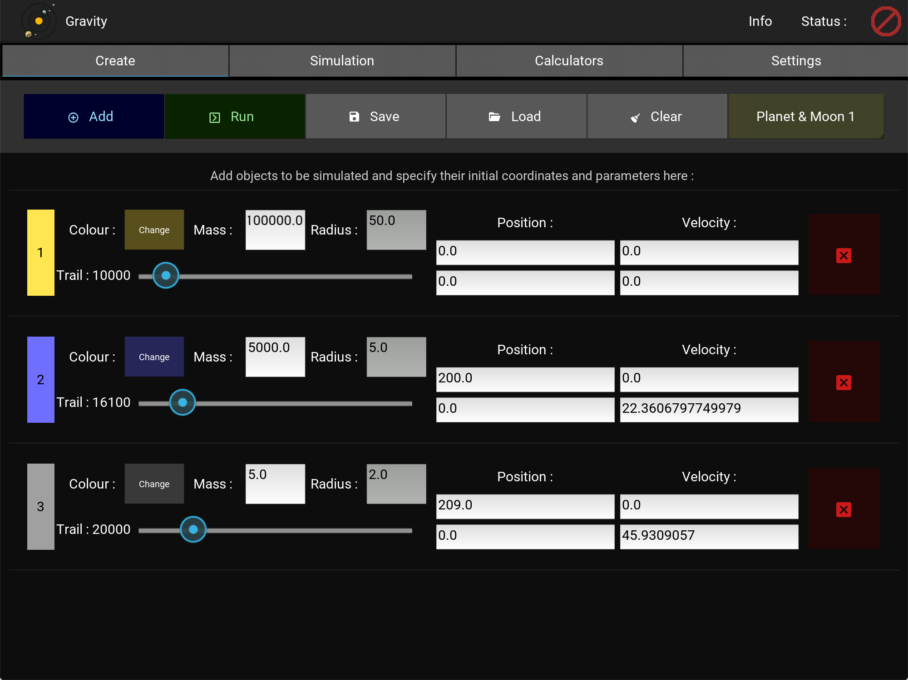
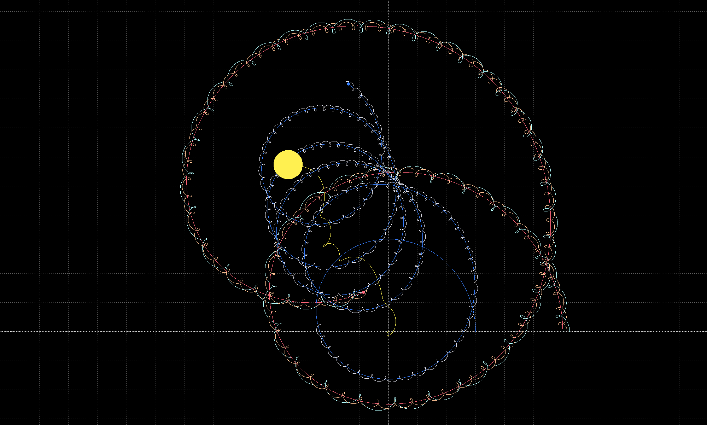

# gravity
Simulate the interaction of objects in 2D space based on Newtonian gravitation - An app built using Python and Kivy

#### Running the App

This app is written using the Python language and Kivy GUI, which are cross-platform, and can work on [several kinds of devices/OSes](https://kivy.org/doc/stable/gettingstarted/installation.html). No standalone builds/distributions have been created yet for this app, so you will have to run from source :

1. An installation of [Python 3.7 or newer](https://www.python.org/downloads/) is required on your system.
2. `git clone` this repository into a directory of your choice. The app will be installed there.
3. Install the modules that are not part of the python standard library :
  - [Kivy](https://kivy.org/doc/stable/gettingstarted/installation.html) 1.11 or newer
  - [Sympy](https://www.sympy.org/en/index.html)
  > Note: It is [highly recommended](https://kivy.org/doc/stable/gettingstarted/installation.html#create-virtual-environment) to install Kivy in a [`venv`](https://pypi.org/project/virtualenv/). Use the app/repo directory as a virtual env.
4. Run `python3 main.py`

